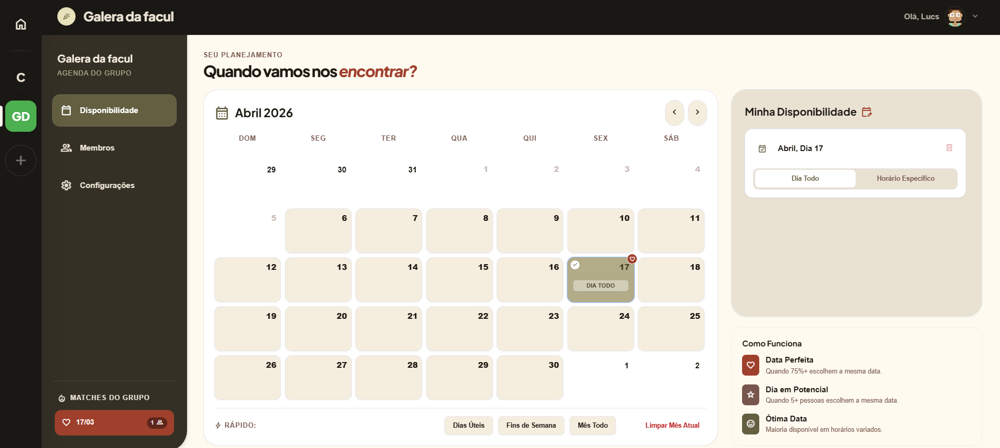

# 📅 Marcaí - O Fim dos Desencontros

O **Marcaí** é uma aplicação web progressiva (PWA) desenvolvida para resolver um problema universal: alinhar a agenda de grupos de amigos e equipes. 

Através de um painel interativo e responsivo, os usuários podem criar servidores (grupos), marcar seus dias e horários livres, e o sistema cruza os dados para encontrar os **"Matches"** perfeitos — os dias em que a maioria das pessoas está disponível.

🌐 **Status do Projeto:** Concluído e em Produção.

---

## ✨ Principais Funcionalidades

### 🧠 Algoritmo de Matches Inteligente
O coração da aplicação. O sistema analisa a disponibilidade cruzada de todos os membros de um grupo e categoriza as datas em três níveis:
- 💖 **Data Perfeita:** 75% ou mais do grupo disponível.
- ⭐ **Dia em Potencial:** 5 ou mais pessoas disponíveis no mesmo dia.
- 😃 **Ótima Data:** Maioria simples disponível, mesmo que em horários variados.

### 🛡️ Segurança e Banco de Dados (BaaS)
- **Autenticação Segura:** Login social via Google integrado.
- **Row Level Security (RLS):** O banco de dados foi blindado direto na fonte (PostgreSQL). Regras rigorosas garantem que um usuário só possa manipular seus próprios dados de disponibilidade e que apenas os administradores possam gerenciar expulsões ou exclusão de grupos.

### 📱 Experiência de Usuário e UI/UX
- **Progressive Web App (PWA):** Instalável em dispositivos móveis como um aplicativo nativo.
- **Design Responsivo:** Interface fluida que se adapta desde monitores ultrawide até telas de celulares, utilizando navegação em *Off-Canvas* (Menu Hamburger) em telas menores.
- **Customização Sutil:** Modo Claro e um Modo Escuro (Dark Mode) exclusivo com uma paleta de cores "quentes" focada em conforto visual e legibilidade.
- **Gerador de Avatares Dinâmico:** Integração via API para gerar centenas de combinações de avatares automáticos (humanos, robôs, pixel-art, etc.) para os perfis dos usuários.

---

## 🛠️ Tecnologias Utilizadas

**Front-end:**
- [React.js](https://reactjs.org/)
- [Vite](https://vitejs.dev/) (Build tool ultrarrápido)
- [Tailwind CSS](https://tailwindcss.com/) (Estilização baseada em utilitários)

**Back-end & Infraestrutura:**
- [Supabase](https://supabase.com/) (BaaS, PostgreSQL, Auth, Row Level Security)
- [Vercel](https://vercel.com/) (Hospedagem e CI/CD)

---

## 🚀 Como testar o projeto

Acesse https://marca-tau.vercel.app/

## 👨‍💻 Sobre o Desenvolvedor

**Lucas** *Apaixonado por programação, universo e pela criação do meu próprio.*

---

## 📝 Licença

Este projeto está sob a licença MIT. Veja o arquivo [LICENSE](LICENSE) para mais detalhes.